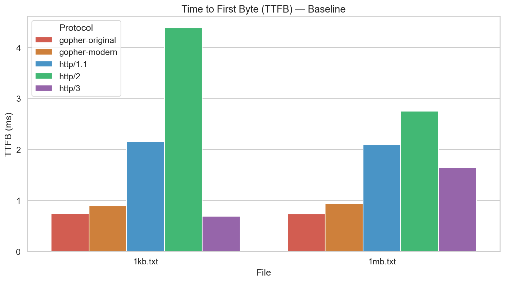

# Hypothesis 1: Simpler protocols achieve lower TTFB under baseline conditions

## Local Testing

We performed a handshake test under baseline scenarios and found that Gopher (Original) and HTTP/3 presented the lowest TTFB out of all the protocols we tested.

**Reason:** Gopher (Original) has minimal protocol overhead which reduces processing time, while HTTP/3's QUIC design removes the TCP 3-way handshake which reduces the connection setup required for transferring data.

## Remote Testing

We performed a handshake test under baseline scenarios and found that HTTP/3 achieved the best performance for 1kb.txt, while Gopher (Modern) achieved the best performance for 1mb.txt

**Reason:** For small files, HTTP/3 achieves the lowest TTFB due to its 0-RTT QUIC handshake, which minimizes connection establishment overhead when data transfer is negligible. For larger files, Gopher (Modern) achieves the lowest TTFB because its extremely simple protocol reduces server-side processing overhead, giving it a slight edge once connection costs become less dominant.

