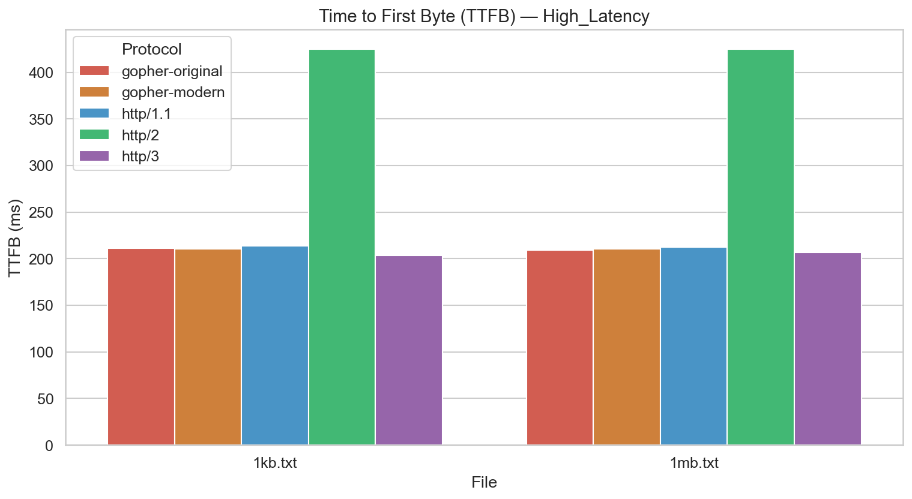
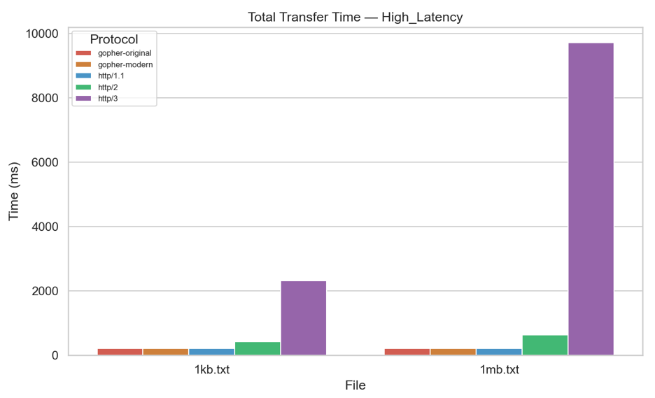
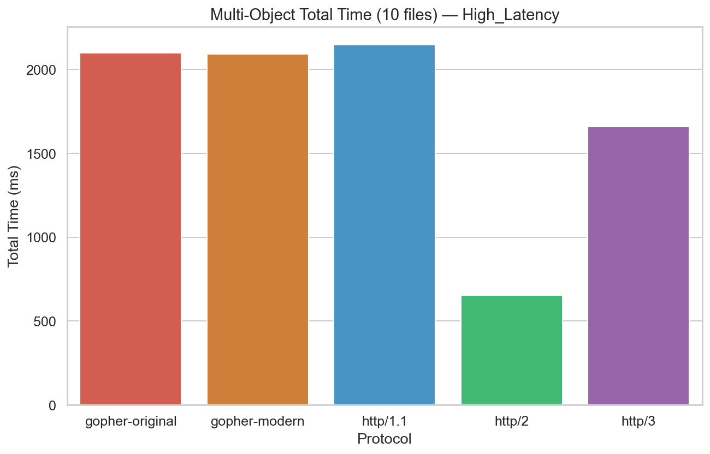
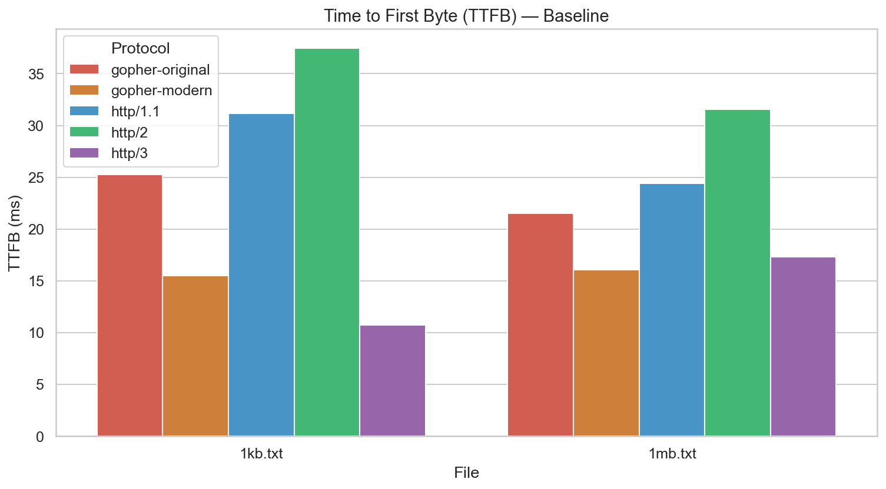
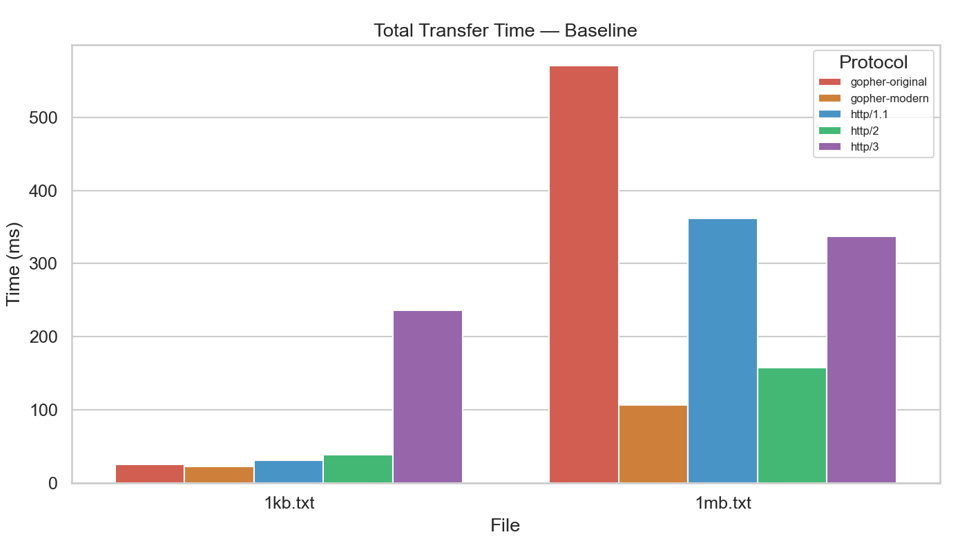
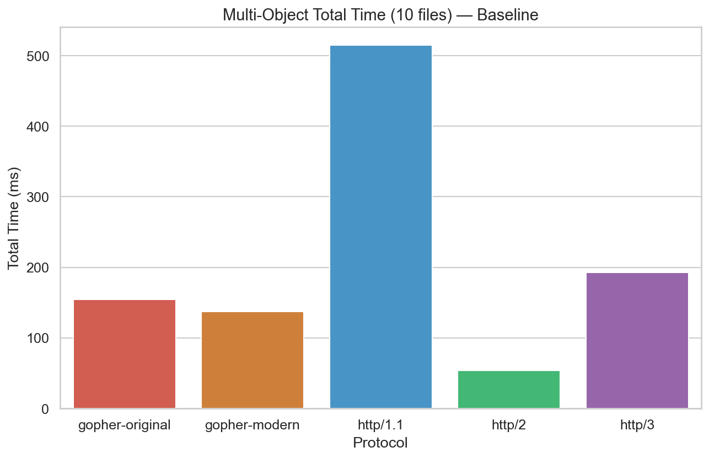

# Hypothesis 3
## Local Testing

We performed throughput tests under baseline scenarios and found that HTTP/1.1 has achieved the highest throughput for a 1MB file transfer, supporting our hypothesis

**Reason:** HTTP/1.1 achieved the highest throughput due to its simplicity and optimisation in the TCP stack, such as zero-copy transfers, offloading, and congestion control. HTTP/3 achieved the worst performance here due to additional encryption and processing overheads.

## Remote Testing

However, when we performed the same test under remote, Gopher (Modern) and HTTP/2 performed with much higher throughput as compared to HTTP/1.1

**Reason:** Here, HTTP/1.1 performs more poorly due to its sequential request-response model, where head-of-line blocking and round-trip delays waste bandwidth over higher-latency remote networks. In contrast, Gopher (Modern) and HTTP/2 perform much better. Gopher (Modern) achieves the highest throughput due to its ultra-simple, low-overhead design that maximizes data transfer efficiency, while HTTP/2 achieves the second-highest throughput because its multiplexing allows multiple streams to run concurrently, better utilizing available bandwidth.

