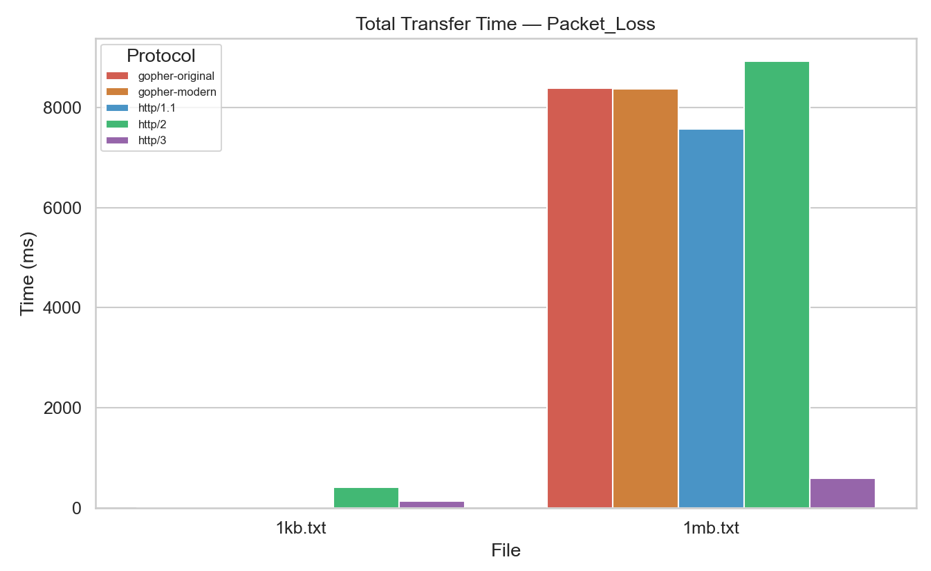
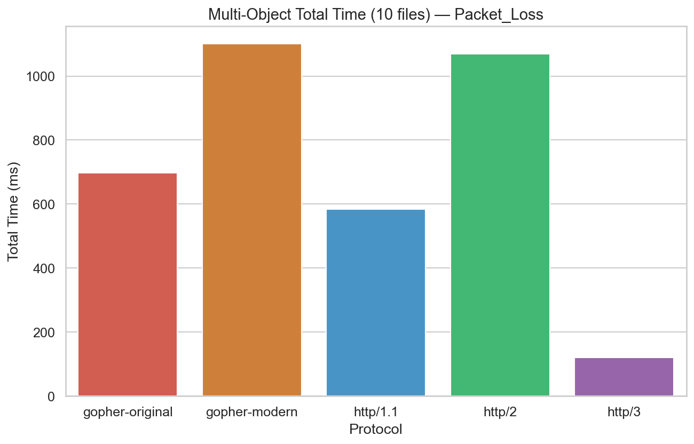
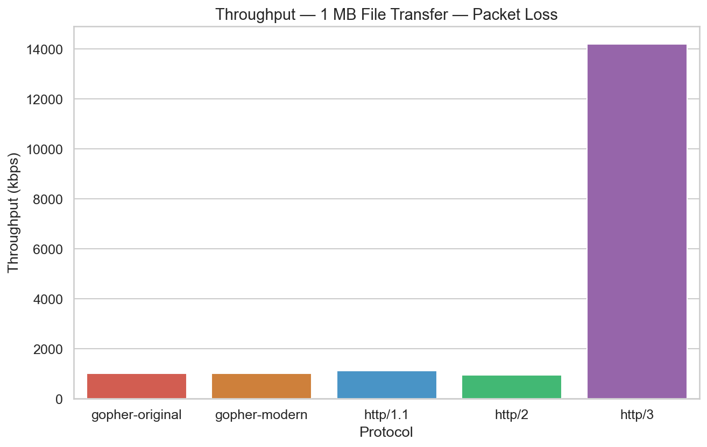
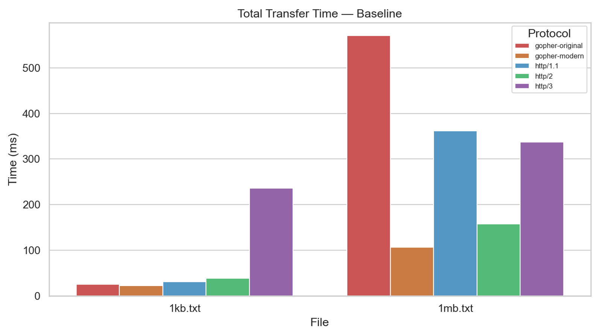
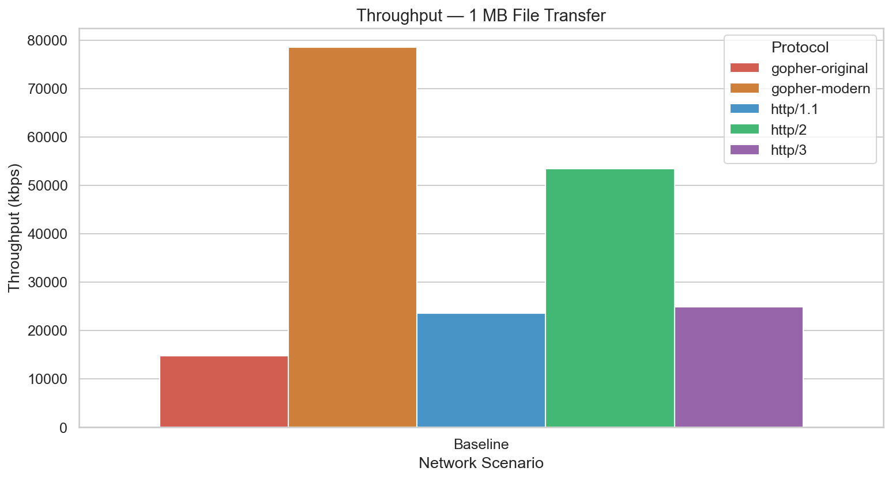

# Hypothesis 4 - HTTP/3 has higher resilience to packet loss as compared to other protocols

## Local Testing

Tests were conducted under the packet loss scenario. From the results, http/3 has the best timings for packet loss for both single object and multi-object requests. Throughput is also the best for http/3.

## Remote Testing

The transfer time results for both single and multi-object requests are quite random and do not really follow any pattern. For total transfer time of the 1kb.txt file, http/3 appears to have an abnormally large time taken, which could be due to unoptimized QUIC libraries. These results are not really meaningful for testing the hypothesis.

In conclusion, the hypothesis is supported by the local test results, but not the remote testing results. 

The results for the local testing are likely due to the fact that http/3 uses the QUIC protocol which uses UDP as transport. QUIC supports independent, parallel streams, and any lost packet only affects its specific stream, allowing other streams to continue delivering data to the application without delay. The other protocols (which use TCP) treat all data as one linear stream, and any packet loss will pause delivery of all subsequent packets until the lost packet is retransmitted successfully. This results in more head of line blocking, and thus worse performance for the other protocols.
