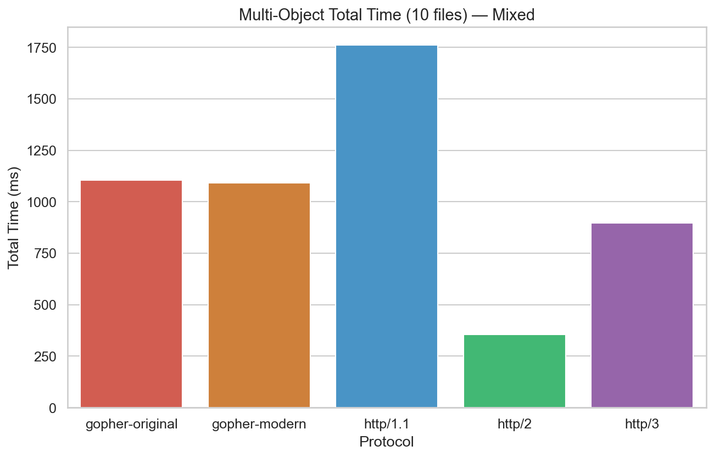

# Hypothesis 5: Gopher-original performs worst on multi-file tests due to connection-per-request overhead

## Local Testing

Gopher-original does perform worse on multi-file tests than every protocol except HTTP/1.1.

**Reason:** Since HTTP/1.1 reuses the same TCP connection, when a packet is lost, all other packets have to wait. However, Gopher-original just creates a new TCP connection.

## Remote Testing

However, when we performed the same test under remote, Gopher-original does perform worse on multi-file tests than every protocol except HTTP/1.1 and HTTP/3.

**Reason:** Here, Since both HTTP/1.1 and HTTP/3 make use of persistent connections, when a packet is lost, all other packets have to wait. However, Gopher-original just creates a new TCP connection.

